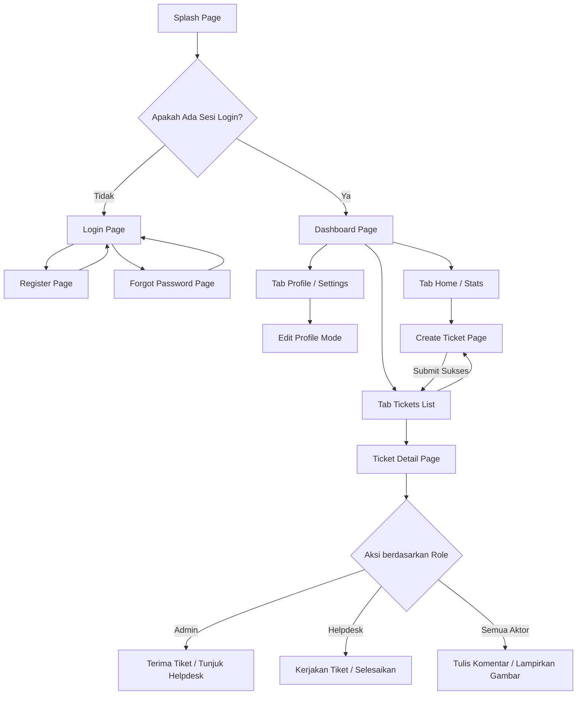
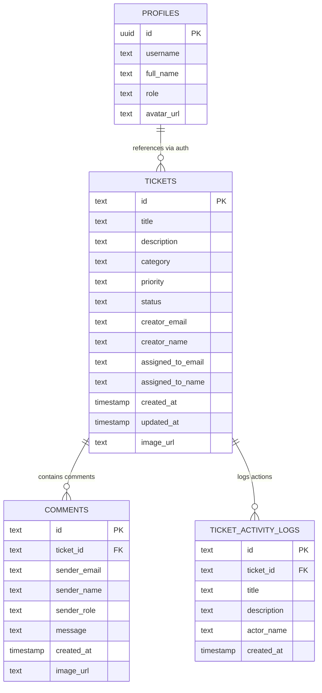

# LAPORAN PENGEMBANGAN PROYEK
## SISTEM E-TICKETING HELPDESK MOBILE

---

## BAB 1: PENDAHULUAN

### 1.1 Latar Belakang
Dalam lingkungan operasional organisasi modern, pengelolaan kendala teknis (insiden TI, masalah perangkat keras, gangguan jaringan, maupun fasilitas kerja) membutuhkan penanganan yang cepat, terorganisasi, dan transparan. Metode pelaporan manual melalui pesan instan chat, email, atau telepon sering kali menyebabkan masalah tidak tercatat dengan baik, hilangnya riwayat penanganan, lambatnya respons dari tim teknisi, serta minimnya transparansi status penyelesaian kendala bagi pelapor.

Untuk mengatasi permasalahan tersebut, dikembangkan sebuah aplikasi mobile **E-Ticketing Helpdesk**. Aplikasi ini dirancang agar dapat diakses kapan saja oleh karyawan untuk melaporkan kendala teknis, yang kemudian akan dikelola secara otomatis oleh Admin dan dialokasikan kepada tim teknisi (Helpdesk/Analyst) yang relevan untuk diselesaikan. Dengan dukungan integrasi backend cloud database, sistem ini memastikan seluruh siklus penanganan tiket tercatat secara real-time dan akurat.

### 1.2 Tujuan Proyek
Proyek ini bertujuan untuk:
1. **Sentralisasi Laporan Kendala:** Menyediakan satu platform terpadu untuk mendokumentasikan semua masalah operasional dan teknis organisasi.
2. **Peningkatan Efisiensi Respons (SLA):** Membantu Admin mempercepat alokasi tiket ke Helpdesk yang tepat, serta meminimalkan delay penyelesaian masalah.
3. **Transparansi Proses:** Menyediakan linimasa aktivitas (*activity log*) dan forum diskusi langsung dalam tiket agar pelapor dan teknisi dapat saling berkoordinasi secara terbuka.
4. **Fleksibilitas Akses:** Menawarkan aplikasi lintas platform (mobile-first) dengan dukungan tampilan antarmuka yang modern, responsif, serta mendukung mode Terang/Gelap (Light/Dark Mode).

### 1.3 Deskripsi Sistem
Aplikasi **Helpdesk Central** merupakan aplikasi mobile berbasis **Flutter** untuk sisi klien dan terintegrasi dengan **Supabase** (PostgreSQL, Auth, Storage) sebagai backend server-nya. 

Sistem ini mendukung fitur-fitur utama sebagai berikut:
* **Autentikasi Pengguna & Manajemen Sesi:** Pengguna dapat melakukan pendaftaran akun (*sign up*), masuk (*sign in*), pemulihan kata sandi (*reset password*), dan keluar (*sign out*) dengan sesi yang tersimpan secara lokal.
* **Manajemen Tiket:** Pembuatan tiket baru disertai dengan judul, deskripsi, kategori (IT Support, Network, Hardware, Software, Facilities), tingkat prioritas (Low, Medium, High), serta pengunggahan foto kendala.
* **Sistem Alur Kerja (Workflows):** Perubahan status tiket dari *Open* -> *Assigned* -> *In Progress* -> *Closed* secara dinamis berdasarkan aksi dari aktor Admin dan Helpdesk.
* **Forum Diskusi Real-time:** Fitur penambahan tanggapan (komentar) interaktif di setiap detail tiket, lengkap dengan opsi lampiran file gambar tambahan.
* **Linimasa Aktivitas (Audit Trail):** Pencatatan otomatis setiap riwayat aksi yang terjadi pada tiket (misalnya: kapan tiket dibuat, kapan ditugaskan ke teknisi tertentu, dan kapan tiket diselesaikan).

---

## BAB 2: ARSITEKTUR & DESAIN ALUR SISTEM

### 2.1 Alur Kerja Navigasi (Flow Diagram)
Berikut adalah visualisasi alur kerja navigasi halaman di dalam aplikasi **Helpdesk Central**:



### 2.2 Deskripsi Role Pengguna (Aktor)
Sistem membagi pengguna ke dalam tiga peran (role) utama dengan wewenang yang berbeda:

1. **User (Karyawan / Pelapor)**
   * **Deskripsi:** Pengguna umum (karyawan internal organisasi) yang mengalami kendala operasional.
   * **Wewenang:**
     * Mendaftar dan mengelola profil akun pribadinya.
     * Membuat tiket pengaduan baru dengan melampirkan foto bukti kendala.
     * Memantau daftar tiket yang dilaporkan beserta status perkembangannya secara berkala.
     * Mengirim pesan diskusi/tanggapan tambahan pada tiket miliknya.
     
2. **Helpdesk (Analyst / Teknisi / Tim Support)**
   * **Deskripsi:** Staf teknis yang bertugas melakukan perbaikan kendala di lapangan.
   * **Wewenang:**
     * Membaca daftar seluruh tiket masuk yang ditugaskan kepada mereka.
     * Menerima tiket (*In Progress*) saat tiket tersebut dialokasikan oleh Admin.
     * Berkomunikasi dengan pelapor melalui kolom diskusi tiket untuk menanyakan detail kendala atau mengunggah bukti perbaikan.
     * Menandai tiket sebagai selesai (*Closed*) setelah kendala berhasil diatasi.

3. **Admin (Supervisor / Koordinator Helpdesk)**
   * **Deskripsi:** Koordinator yang bertugas mengawasi seluruh masuknya laporan serta performa tim teknis.
   * **Wewenang:**
     * Memantau dashboard statistik kinerja tiket secara keseluruhan (jumlah tiket Open, Assigned, In Progress, Closed).
     * Menerima/menyetujui tiket baru masuk (*Accept Ticket*) yang mengubah status tiket menjadi *Assigned*.
     * Memilih staf Helpdesk spesifik (*Assign Technical Analyst*) untuk menangani tiket yang aktif.
     * Memiliki akses penuh untuk membaca dan meninjau seluruh tiket yang ada di dalam organisasi.

---

## BAB 3: DATABASE & INTEGRASI BACKEND API

### 3.1 Skema Database Relasional (Supabase PostgreSQL)
Relasi antartabel di dalam database PostgreSQL Supabase dirancang sebagai berikut:



### 3.2 Detail Tabel dan Batasan (Constraints)
Berikut adalah spesifikasi struktur tabel pada database PostgreSQL:

#### 1. Tabel `profiles`
Menyimpan data detail profil pengguna yang tersinkronisasi otomatis dengan `auth.users` bawaan Supabase Auth.
* **Constraints & Rules:**
  * `id` bertipe `uuid` bertindak sebagai Primary Key dan memiliki relasi referensi ke tabel `auth.users` dengan aturan `ON DELETE CASCADE`.
  * `username` bersifat `UNIQUE` dan `NOT NULL`.
  * `role` memiliki nilai bawaan (default) `'User'` dengan batasan **CHECK Constraint** (`profiles_role_check`) yang hanya menerima nilai case-sensitive: **`'User'`**, **`'Helpdesk'`**, atau **`'Admin'`**.

#### 2. Tabel `tickets`
Menyimpan data laporan kendala (tiket) yang diajukan oleh pengguna.
* **Constraints & Rules:**
  * `id` bertipe `text` bertindak sebagai Primary Key (format buatan: `TCK-{timestamp}`).
  * `status` bertipe `text` dengan nilai default `'Open'`.
  * `category` dibatasi pada pilihan kategori yang ditentukan di aplikasi (IT Support, Network, Hardware, Software, Facilities).
  * `priority` dibatasi pada pilihan tingkat prioritas (Low, Medium, High).
  * `creator_email` dan `creator_name` menyimpan data pelapor untuk mempermudah relasi eksternal.

#### 3. Tabel `comments`
Menyimpan percakapan diskusi/tanggapan di dalam sebuah tiket.
* **Constraints & Rules:**
  * `id` bertipe `text` bertindak sebagai Primary Key.
  * `ticket_id` bertindak sebagai Foreign Key yang mereferensikan `tickets(id)` dengan aturan `ON DELETE CASCADE` (jika tiket dihapus, semua tanggapannya ikut terhapus).

#### 4. Tabel `ticket_activity_logs`
Menyimpan audit trail (linimasa aktivitas) log perubahan tiket.
* **Constraints & Rules:**
  * `id` bertipe `text` bertindak sebagai Primary Key.
  * `ticket_id` bertindak sebagai Foreign Key mereferensikan `tickets(id)` dengan aturan `ON DELETE CASCADE`.

---

### 3.3 Integrasi API & Object Storage
Aplikasi Flutter terhubung dengan backend Supabase melalui SDK **`supabase_flutter`** yang memanfaatkan pustaka API berikut:

1. **Authentication (GoTrue API):**
   Digunakan untuk pendaftaran user baru (`signUp`), login user (`signInWithPassword`), verifikasi session saat aplikasi pertama dibuka (`currentSession`), serta logout (`signOut`).
2. **PostgREST (Database API):**
   Digunakan untuk melakukan query CRUD real-time ke tabel PostgreSQL (misalnya operasi `.select()`, `.insert()`, `.update()`, dan filter `.eq()`).
3. **Supabase Storage (Object Storage):**
   * Digunakan untuk mengunggah file gambar/foto kendala yang dilampirkan pengguna saat membuat tiket baru atau memposting komentar.
   * File gambar disimpan di dalam public bucket bernama `ticket-attachments`.
   * Setelah unggah sukses, aplikasi mendapatkan URL publik gambar tersebut untuk disimpan ke dalam kolom `image_url` pada tabel `tickets` atau `comments`.

#### SQL Script Konfigurasi Policy Supabase Storage
Untuk memastikan bucket `ticket-attachments` dapat menerima unggahan berkas dan dapat diakses secara publik, jalankan script SQL berikut di **SQL Editor** Supabase Console Anda:

```sql
-- 1. Membuat Bucket "ticket-attachments" jika belum ada
insert into storage.buckets (id, name, public)
values ('ticket-attachments', 'ticket-attachments', true)
on conflict (id) do nothing;

-- 2. Policy agar file gambar dapat diakses secara publik (SELECT)
create policy "Allow public read access on ticket-attachments"
on storage.objects for select
using ( bucket_id = 'ticket-attachments' );

-- 3. Policy agar pengguna terautentikasi dapat mengunggah file (INSERT)
create policy "Allow authenticated insert access on ticket-attachments"
on storage.objects for insert
with check (
  bucket_id = 'ticket-attachments' 
  and auth.role() = 'authenticated'
);

-- 4. Policy agar pengguna terautentikasi dapat memperbarui file (UPDATE)
create policy "Allow authenticated update access on ticket-attachments"
on storage.objects for update
using (
  bucket_id = 'ticket-attachments' 
  and auth.role() = 'authenticated'
);

-- 5. Policy agar pengguna terautentikasi dapat menghapus file (DELETE)
create policy "Allow authenticated delete access on ticket-attachments"
on storage.objects for delete
using (
  bucket_id = 'ticket-attachments' 
  and auth.role() = 'authenticated'
);
```

---

### 3.4 Dokumentasi API Backend (Postman Collection)

Seluruh endpoint REST API Supabase yang digunakan dalam aplikasi ini telah dibundel ke dalam file koleksi Postman siap pakai yang dapat diunduh dan diimpor langsung:

📁 **File Koleksi:** [helpdesk_postman_collection.json](file:///C:/Users/user/.gemini/antigravity-ide/brain/3e3abd67-2f4c-42d1-910e-d4039d207010/helpdesk_postman_collection.json)

---

#### Cara Import & Konfigurasi Awal

**Langkah 1 — Import ke Postman:**
1. Buka aplikasi **Postman**, lalu klik tombol **Import** (pojok kiri atas).
2. Pilih file `helpdesk_postman_collection.json` → klik **Import**.
3. Koleksi bernama **"E-Ticketing Helpdesk - Supabase API"** akan muncul di panel kiri.

**Langkah 2 — Isi Variabel Koleksi:**
1. Klik nama koleksi di panel kiri → pilih tab **Variables**.
2. Isi kolom **Current Value** (bukan *Initial Value*) untuk setiap variabel berikut:

| Variabel | Nilai | Keterangan |
|---|---|---|
| `supabaseUrl` | `https://qcalvfyckhhmbstflaed.supabase.co` | URL Project Supabase (sudah terisi) |
| `supabaseAnonKey` | *(isi Anon Key dari Supabase Dashboard)* | Kunci publik API untuk header `apikey` |
| `userToken` | *(kosong — diisi otomatis saat Sign In)* | JWT Bearer Token untuk header `Authorization` |
| `userId` | *(kosong — diisi otomatis saat Sign In)* | UUID pengguna yang sedang aktif |
| `userEmail` | *(kosong — diisi otomatis saat Sign In)* | Email pengguna yang sedang aktif |

> [!TIP]
> Jalankan request **Sign In** terlebih dahulu. Skrip otomatis (`Tests`) di dalamnya akan mengisi variabel `userToken`, `userId`, dan `userEmail` secara langsung, sehingga semua request lain siap digunakan tanpa salin-tempel token manual.

---

#### Grup 1 — Authentication

Header yang dibutuhkan pada semua request Auth: `apikey: {{supabaseAnonKey}}`

**① Sign Up (Daftar Akun Baru)**

| Atribut | Nilai |
|---|---|
| **Method** | `POST` |
| **Endpoint** | `{{supabaseUrl}}/auth/v1/signup` |
| **Auth Header** | `apikey: {{supabaseAnonKey}}` |

Request Body (JSON):
```json
{
    "email": "nama@example.com",
    "password": "password123",
    "data": {
        "username": "nama_unik",
        "full_name": "Nama Lengkap",
        "role": "User"
    }
}
```
> ⚠️ Nilai `"role"` harus ditulis **huruf kapital di awal**: `"User"`, `"Helpdesk"`, atau `"Admin"`. Jika `username` sudah terdaftar di database, server akan mengembalikan error `23505 - duplicate key`.

Respons Sukses (`200 OK`):
```json
{ "id": "uuid-pengguna-baru", "email": "nama@example.com", ... }
```

---

**② Sign In (Masuk ke Sistem)**

| Atribut | Nilai |
|---|---|
| **Method** | `POST` |
| **Endpoint** | `{{supabaseUrl}}/auth/v1/token?grant_type=password` |
| **Auth Header** | `apikey: {{supabaseAnonKey}}` |

Request Body (JSON):
```json
{
    "email": "nama@example.com",
    "password": "password123"
}
```

Respons Sukses (`200 OK`) — variabel `userToken`, `userId`, `userEmail` akan terisi otomatis:
```json
{
    "access_token": "eyJhbGci...",
    "token_type": "bearer",
    "user": { "id": "uuid-...", "email": "nama@example.com" }
}
```

---

#### Grup 2 — Profiles

Header yang dibutuhkan: `apikey: {{supabaseAnonKey}}` + `Authorization: Bearer {{userToken}}`

**① Ambil Profil Pengguna Aktif**

| Atribut | Nilai |
|---|---|
| **Method** | `GET` |
| **Endpoint** | `{{supabaseUrl}}/rest/v1/profiles?id=eq.{{userId}}&select=*` |

Respons Sukses (`200 OK`):
```json
[{ "id": "uuid-...", "username": "nama", "full_name": "Nama Lengkap", "role": "User", "avatar_url": null }]
```

**② Ubah Role Pengguna**

| Atribut | Nilai |
|---|---|
| **Method** | `PATCH` |
| **Endpoint** | `{{supabaseUrl}}/rest/v1/profiles?id=eq.{{userId}}` |

Request Body (JSON):
```json
{ "role": "Admin" }
```
> ⚠️ Nilai `role` **harus kapital**: `"Admin"`, `"Helpdesk"`, atau `"User"`. Nilai lain (misal `"admin"` huruf kecil) akan ditolak database dengan error `23514 - check constraint violation`.

---

#### Grup 3 — Tickets

Header yang dibutuhkan: `apikey: {{supabaseAnonKey}}` + `Authorization: Bearer {{userToken}}`

**① Ambil Semua Tiket**

| Atribut | Nilai |
|---|---|
| **Method** | `GET` |
| **Endpoint** | `{{supabaseUrl}}/rest/v1/tickets?select=*&order=created_at.desc` |

**② Buat Tiket Baru**

| Atribut | Nilai |
|---|---|
| **Method** | `POST` |
| **Endpoint** | `{{supabaseUrl}}/rest/v1/tickets` |

Request Body (JSON):
```json
{
    "id": "TCK-1783350000000",
    "title": "Judul Masalah",
    "description": "Deskripsi detail kendala.",
    "category": "Hardware",
    "priority": "High",
    "status": "Open",
    "creator_email": "{{userEmail}}",
    "creator_name": "Nama Pelapor"
}
```
> Nilai `"category"` yang valid: `"IT Support"`, `"Network"`, `"Hardware"`, `"Software"`, `"Facilities"`.
> Nilai `"priority"` yang valid: `"Low"`, `"Medium"`, `"High"`.

**③ Tugaskan Tiket ke Helpdesk (Admin)**

| Atribut | Nilai |
|---|---|
| **Method** | `PATCH` |
| **Endpoint** | `{{supabaseUrl}}/rest/v1/tickets?id=eq.TCK-1783350000000` |

Request Body (JSON):
```json
{
    "assigned_to_email": "helpdesk@example.com",
    "assigned_to_name": "Nama Teknisi",
    "status": "In Progress"
}
```

**④ Selesaikan Tiket (Helpdesk)**

| Atribut | Nilai |
|---|---|
| **Method** | `PATCH` |
| **Endpoint** | `{{supabaseUrl}}/rest/v1/tickets?id=eq.TCK-1783350000000` |

Request Body (JSON):
```json
{ "status": "Closed" }
```

---

#### Grup 4 — Comments & Activity Logs

Header yang dibutuhkan: `apikey: {{supabaseAnonKey}}` + `Authorization: Bearer {{userToken}}`

**① Ambil Komentar pada Tiket**

| Atribut | Nilai |
|---|---|
| **Method** | `GET` |
| **Endpoint** | `{{supabaseUrl}}/rest/v1/comments?ticket_id=eq.TCK-1783350000000&select=*&order=created_at.asc` |

**② Tambahkan Komentar Baru**

| Atribut | Nilai |
|---|---|
| **Method** | `POST` |
| **Endpoint** | `{{supabaseUrl}}/rest/v1/comments` |

Request Body (JSON):
```json
{
    "id": "COM-1783359999999",
    "ticket_id": "TCK-1783350000000",
    "sender_email": "{{userEmail}}",
    "sender_name": "Nama Pengirim",
    "sender_role": "User",
    "message": "Isi pesan tanggapan di sini."
}
```

**③ Ambil Riwayat Audit Log**

| Atribut | Nilai |
|---|---|
| **Method** | `GET` |
| **Endpoint** | `{{supabaseUrl}}/rest/v1/ticket_activity_logs?ticket_id=eq.TCK-1783350000000&select=*&order=created_at.asc` |

---

## BAB 4: DESAIN UI/UX & PANDUAN PENGEMBANGAN

### 4.1 Panduan Warna (Color Palette)
Aplikasi menerapkan palet warna modern bertema **Premium Navy & Slate** dengan dukungan dinamis Mode Terang dan Gelap.

| Elemen Desain | Kode Warna (Light Mode) | Kode Warna (Dark Mode) | Deskripsi Penggunaan |
|---|---|---|---|
| **Primary Navy** | `#00236F` | `#00236F` | Warna utama brand, header, tombol utama |
| **Secondary Blue** | `#0058BE` | `#0058BE` | Warna aksen interaktif, link, hover state |
| **Background (Bg)** | `#F8F9FF` | `#0F172A` | Warna dasar canvas aplikasi |
| **Card Surface** | `#FFFFFF` | `#1E293B` | Latar belakang modul, list item, form box |
| **Text Primary** | `#0B1C30` | `#F8F9FF` | Warna teks utama (Judul, Header) |
| **Text Secondary**| `#444651` | `#C5C5D3` | Warna deskripsi, label, instruksi kecil |
| **Border Line** | `#C5C5D3` | `#444651` | Warna garis pembatas elemen |
| **Input Fill** | `#EFF4FF` | `#1E293B` | Latar belakang field input text |

#### Warna Status & Prioritas:
* **Open / High:** Red (`#EF4444`)
* **Assigned / Medium:** Amber/Orange (`#F59E0B`)
* **In Progress / Low:** Blue (`#3B82F6`)
* **Closed:** Emerald Green (`#10B981`)

### 4.2 Tipografi (Typography)
Tipografi didesain menggunakan pustaka Google Fonts guna memberikan tampilan visual yang bersih dan mudah dibaca:
1. **`Hanken Grotesk`:** Digunakan khusus untuk Judul Utama, Header Halaman, dan Elemen Branding (memberikan kesan kokoh dan modern).
2. **`Inter`:** Digunakan untuk semua teks isi (Body text), menu, label form input, dan tombol (memberikan readability tinggi pada layar perangkat mobile).
3. **`JetBrains Mono`:** Digunakan untuk penulisan ID Tiket, label teknis, tanggal/waktu relatif, dan status (memberikan nuansa presisi khas sistem helpdesk).

### 4.3 Komponen UI Utama
* **Ticket Card:** Menggunakan bayangan lembut (*box shadow*) dengan sudut melengkung (*border-radius: 12px*), lencana status berlatar transparan sesuai warna statusnya, serta indikator prioritas di tepi kiri kartu.
* **Comment Bubble:** Gelembung percakapan dengan warna kontras berbeda antara pengirim (user sendiri berlatar navy/blue lembut di kanan) dan penerima (staf teknisi berlatar slate abu-abu di kiri).
* **Modern Form Input:** Text field tanpa border luar (menggunakan warna background fill lembut), dengan transisi animasi garis aksen saat aktif (*focused border*).

---

## BAB 5: ARSITEKTUR KODE & KESIMPULAN

### 5.1 Struktur Kode Proyek (Clean Architecture)
Proyek diimplementasikan menggunakan pola **Clean Architecture** yang terbagi menjadi beberapa modul fitur. Struktur direktori utamanya adalah sebagai berikut:

```
lib/
├── core/
│   ├── constants/        # Nilai konstan aplikasi (URL Supabase, API Key, Kategori)
│   ├── theme/            # Pengaturan tema Light/Dark & tipografi terpusat
│   └── utils/            # Utilitas pembantu (format tanggal, dll)
├── features/
│   ├── auth/             # Modul Login, Register, & Reset Password
│   │   ├── data/         # Model data akun pengguna (UserModel)
│   │   └── presentation/ # Tampilan UI (login_page, register_page) & AuthProvider
│   ├── profile/          # Modul manajemen profil pengguna
│   │   └── presentation/ # Tampilan UI profil dan edit info pengguna
│   └── ticket/           # Modul tiket, komentar, dan log aktivitas
│       ├── data/         # Model data (TicketModel, CommentModel, ActivityLog)
│       └── presentation/ # Halaman (dashboard_page, ticket_detail_page) & TicketProvider
└── main.dart             # Titik masuk aplikasi (Inisialisasi Supabase & Riverpod)
```

#### State Management:
* Proyek menggunakan **Riverpod (`flutter_riverpod`)** dengan memanfaatkan `ChangeNotifierProvider` untuk memisahkan logika data backend (`AuthProvider` dan `TicketProvider`) dari kode rendering antarmuka (Widgets). Hal ini mempermudah perawatan kode, pengujian unit test, serta memastikan sinkronisasi data yang cepat.

---

### 5.2 Informasi Lampiran
* **Situs Proyek Backend:** [Supabase Console](https://supabase.com)
* **Perintah Pembersihan Build Proyek:**
  ```bash
  flutter clean
  flutter pub get
  ```
* **Perintah Menjalankan Aplikasi di Windows Desktop:**
  ```bash
  flutter run -d windows
  ```
* **Perbaikan Isu Layout Penting:**
  Aplikasi telah diperbaiki dari masalah crash rendering tak terbatas (*infinite width constraint error*) pada tombol komentar di halaman detail tiket. Masalah diselesaikan dengan mengganti batasan lebar default `minimumSize: Size.fromHeight(56)` di file tema global `app_theme.dart` menjadi `Size(0, 56)` yang adaptif terhadap constraint tata letak `Row`.

---
*Laporan ini disusun sebagai dokumentasi resmi teknis arsitektur sistem E-Ticketing Helpdesk Mobile.*
